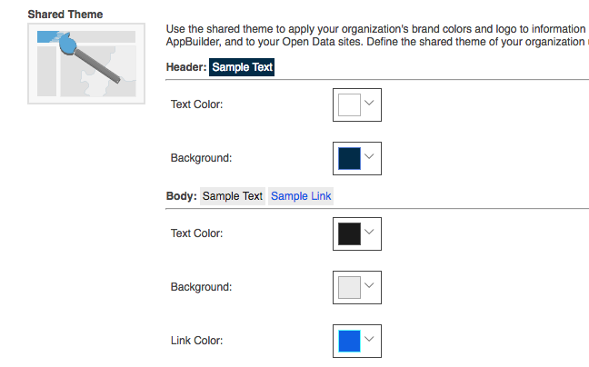

# hub-ready-apps

> documentation for creating civic tech apps that scale (working draft)

## Table of Contents

- [What _is_ a **Hub**?](#what-is-a-hub)
- [What _is_ a **Hub Ready App**?](#what-is-a-hub-ready-app)
  - [X] [Live Content](#live-content)
  - [X] [Indicator Aware](#indicator-aware)
  - [X] [Identity](#identity)
  - [X] [Shared Theme](#shared-theme)
  - [X] [Data Citation](#data-citation)
- Best Practices
  - [X] [Durable State](#durable-state)
  - [X] [Accessibility](#accessibility)
  - [X] [Responsive](#responsive)
  - [X] [Telemetry](#telemetry)
  - [X] [I18n](#i18n)
  - [X] [Discussions](#disussions)
  - [X] [Versioning](#versioning)
  - [X] [License](#license)
- Aspirational
  - [ ] [Connected Apps](#connected-apps)*
  - [ ] [App Switcher](#app-switcher)*
  - [ ] [Global Profile](#global-profile)*
- [Tools](#tools)

## What _is_ a **Hub**?

[ArcGIS Hub](http://hub.arcgis.com/) provides a two-way engagement platform to connect government and citizens.

[](https://esri.app.box.com/s/edd8di8sy5r8wxyrcnl2v4mh3n5bwjpj)

> An interactive platform to organize people, processes, and technology. ArcGIS Hub comes with built-in event creation and allows you to gather feedback from inside and outside your organization to find or create new solutions to existing problems.

## What _is_ a **Hub Ready** App?

Hub-Ready Apps integrate with the Hub administrative and community user experience and provide simple workflows to inform, listen and monitor important initiatives.

Hub-Ready Apps extend the ArcGIS configurable app pattern to share and re-use solutions that integrate directly with the Hub architecture and organization datasets and branding.

**Note: Your own app doesn't need to implement _each and every_ pattern described in our checklist to be considered *Hub Ready*.**

## Live Content

<!--
~~static data~~
1. hardcoded web service
2. configurable app
3. with or w/o webmap
4. indicator aware app 🙏
-->

using Item config and Group Permissions (with Configurable ArcGIS Content)

Apps should be centrally managed, but then reusable through dynamic configurations that are loaded at runtime. This supports many organizations each maintaining [configured](http://doc.arcgis.com/en/arcgis-online/create-maps/create-app-templates.htm) versions of the app using a single deployment. This minimizes development, deployment, and operational overhead. Read more about the [configurable app specification](http://doc.arcgis.com/en/arcgis-online/create-maps/configurable-templates.htm)

A [Configurable App Template](http://doc.arcgis.com/en/arcgis-online/create-maps/create-app-templates.htm) defines its `configurationSettings`, and a Configured App stores its `values`.

- [StoryMap Template](https://www.arcgis.com/sharing/rest/content/items/94c57691bc504b80859e919bad2e0a1b/data?f=json)

A Template can also include default `values`.

Using the same StoryMap template, we have configured versions for two cities:

- [StoryMap: Los Angeles](http://www.arcgis.com/apps/StoryMapBasic/index.html?appid=ddd535ae55c843c0a569729efb0bdd0b)
 - [StoryMap Configuration](https://www.arcgis.com/sharing/rest/content/items/ddd535ae55c843c0a569729efb0bdd0b/data?f=json)
- [StoryMap: Albany](http://www.arcgis.com/apps/StoryMapBasic/index.html?appid=dd4813fd4ee64b5fa9db764ebd0dda80)
 - [StoryMap Configuration](https://www.arcgis.com/sharing/rest/content/items/dd4813fd4ee64b5fa9db764ebd0dda80/data?f=json)

Our [Configurable App Examples](https://github.com/Esri/configurable-app-examples-4x-js) leverage a helper called [`ApplicationBase`](https://github.com/Esri/application-base-js) to handle configuration JSON.

## Identity

for authentication and community

### Global Profile

for saving views and collaboration


- Log into any app
- Save current view to a group
- Zoom to saved bookmarks
- Add layers to app
- Save layers from app to my favorites

## Shared Theme

Hub Ready Apps don't hardcode design elements or require manual configuration to inherit the unique style of the agency that deploys the solution. The information is retrieved on the fly.



```json
{
  "portalProperties": {
    "sharedTheme": {
      "header": {
        "background": "#002b49",
        "text": "#ffffff"
      },
      "body": {
        "text": "#1a1a1a",
        "background": "#ebebeb",
        "link": "#005ce6"
      },
      "button": {
        "text": "#002673",
        "background": "#ffffff"
      },
      "logo": {
        "small": "https://cityx.maps.arcgis.com/sharing/rest/content/items/5c9e486b701e4222bf5386da64908ae1/data",
        "link": "https://cityx.maps.arcgis.com/sharing/rest/content/items/5c9e486b701e4222bf5386da64908ae1/data"
      }
    }
  }
}
```

* [Introducing Shared Themes](https://blogs.esri.com/esri/arcgis/2017/02/27/introducing-a-new-app-styling-capability-in-arcgis-online/)
* [Using Shared Themes in StoryMaps](https://blogs.esri.com/esri/arcgis/2017/03/03/shared-theme-in-story-maps/)

## Durable State

Consistent URI parameters across all apps: (using URL of current view)

- Location
- Zoom/Center
- Basemap
- Theme/Org
- Selected features
- Additional Layers

## Accessibility

for impaired users following WCAG & a11y

## Indicator Aware

for Initiative configuration

## Telemetry

> 'That which is measured, improves' - [Thomas S Monson](https://english.stackexchange.com/questions/14952/that-which-is-measured-improves)

ArcGIS Hub encourages public agencies to track changes in datasets over time to measure the impact of policy changes and community participation in addressing key problems.

A Hub Ready App, in the same light, should attempt to measure its own efficacy by logging information on usage, performance, errors and the successful completion of pre-defined user workflows.

## Responsive

> "The share of Americans that own smartphones is now 77%, up from just 35% ... in 2011." [- Pew Research](http://www.pewinternet.org/fact-sheet/mobile/)

> "Today just over one-in-ten American adults are “smartphone-only” internet users – meaning they own a smartphone, but do not have traditional home broadband service." [- Pew Research](http://www.pewinternet.org/fact-sheet/mobile/)

Building a mobile friendly application should be considered a requirement if your goal is to reach anyone with internet access.

## i18n

Besides making it more likely that your application could be deployed in more than one location, providing translations for languages other than english broadens the reach of your application _within_ a city by including a more diverse collection of stakeholders.

Open source frameworks like Dojo and JQuery have provided tooling to help internationalize applications for many years. These days there are compact framework agnostic options like [Polyglot](https://github.com/airbnb/polyglot.js) as well.

## Data Citation

Its absolutely crucial that you attribute the providers of the data your application consumes.


- Link to Open Data
- Link to Item Page
- Link to Service

## Discussions

for collaboration and feedback

## Versioning

Using [version control](https://en.wikipedia.org/wiki/Version_control) to track changes in your code and tagging releases when you've reached a milestone makes it easier to collaborate with others.

Keeping a [changelog](http://keepachangelog.com/en/1.0.0/) gives transparency into what has changed.

## Connected Apps

between Hub Initiatives


- Discover related apps for the same theme, area, initiative
- Selecting related app opens at same 'state' (e.g. at my house)

## App Switcher

between related Hub apps

## New Experiences


## Tools

<!-- to do:
discuss continuum of small building blocks to death star lego sets
-->

https://github.com/Esri/arcgis-rest-js
https://github.com/Esri/arcgis-ember-portal-services
https://github.com/Esri/configurable-app-examples-4x-js

## License

For Open Data, a license is a [**must**](https://creativecommons.org/licenses/). You should also consider including a `license` if you plan to distibute a Hub Ready App.

For projects Esri shares on GitHub, we usually choose [`Apache-2.0`](https://spdx.org/licenses/Apache-2.0.html).

Copyright 2017 Esri

Licensed under the Apache License, Version 2.0 (the "License");
you may not use this file except in compliance with the License.
You may obtain a copy of the License at

> http://www.apache.org/licenses/LICENSE-2.0

Unless required by applicable law or agreed to in writing, software
distributed under the License is distributed on an "AS IS" BASIS,
WITHOUT WARRANTIES OR CONDITIONS OF ANY KIND, either express or implied.
See the License for the specific language governing permissions and
limitations under the License.

A copy of the license is available in the repository's [LICENSE](./LICENSE) file.